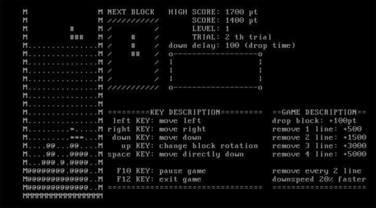

# TETRIS

### Environment
- RedHat Linux 6.2, GCC compiler

### Screenshot

### Feature
* ↑: Rotate
* ←→: Move left/right
* ↓: Down (wait)
* Space: Down (without wait)
* Do not rotate when blocked
* Random blocks
* Score
* High score
* Shadow block (show block down position)
* Pause game
* Level
* Elapsed time

### Source code: 
* [tetris.c](https://github.com/akagaeng/tetris/blob/master/code/tetris.c)
